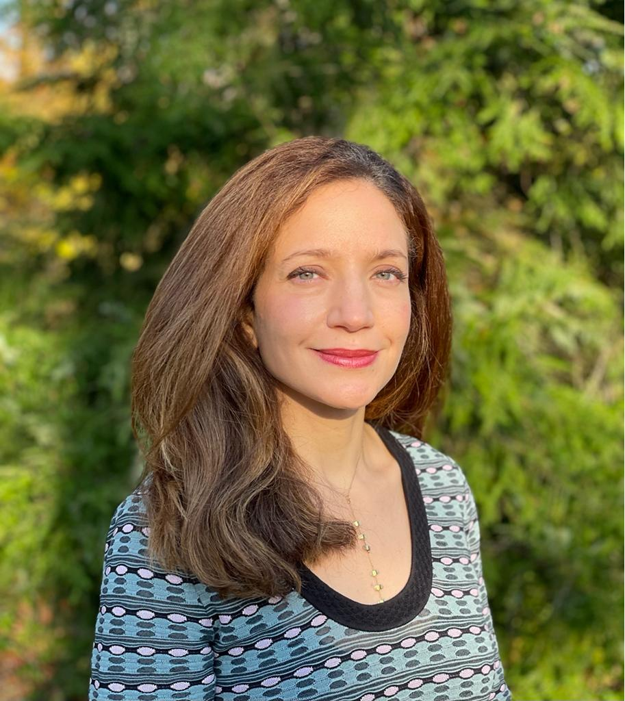

<section>
  

    

      
    

    

      

        Dr. Ayse Kaya Orloff is an expert in <strong>international political economy</strong>, including
        <strong>international financial institutions</strong> and <strong>global environmental governance</strong>.

          

        She is a Professor at Swarthmore College and an Adjunct Professor at the Wharton School (University of Pennsylvania). Her PhD is from the London School of Economics, from where she also holds a separate Master's degree (Comparative Politics). She completed her undergraduate degree at Wellesley College (summa cum laude, Phi Beta Kappa, honors) and her post-doctoral fellowship at Columbia University. As a Council on Foreign Relations fellow and a special government employee, she worked at the U.S. Department of State. She was born and raised in Istanbul.
        
         
    
See my <a href="/publications/">publications</a> for my books, peer-reviewed articles, chapters, and policy papers.

    (Publications are under Kaya only.)
      

    

  

</section>

