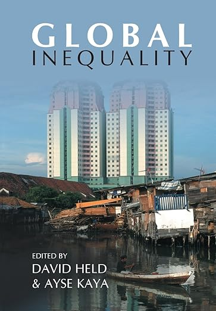
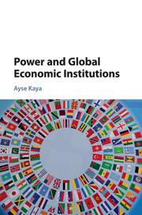

  
  

Ayse Kaya Orloff is an expert in International Political Economy, including international financial institutions and global environmental governance.  

She is a Professor at Swarthmore College and an Adjunct Professor at the Wharton School (University of Pennsylvania). Her PhD is from the London School of Economics, from where she also holds a separate Master's degree (Comparative Politics). She completed her undergraduate degree at Wellesley College (summa cum laude, Phi Beta Kappa, honors) and her post-doctoral fellowship at Columbia University. She was born and raised in Istanbul.
(Publications are under Kaya only.)

